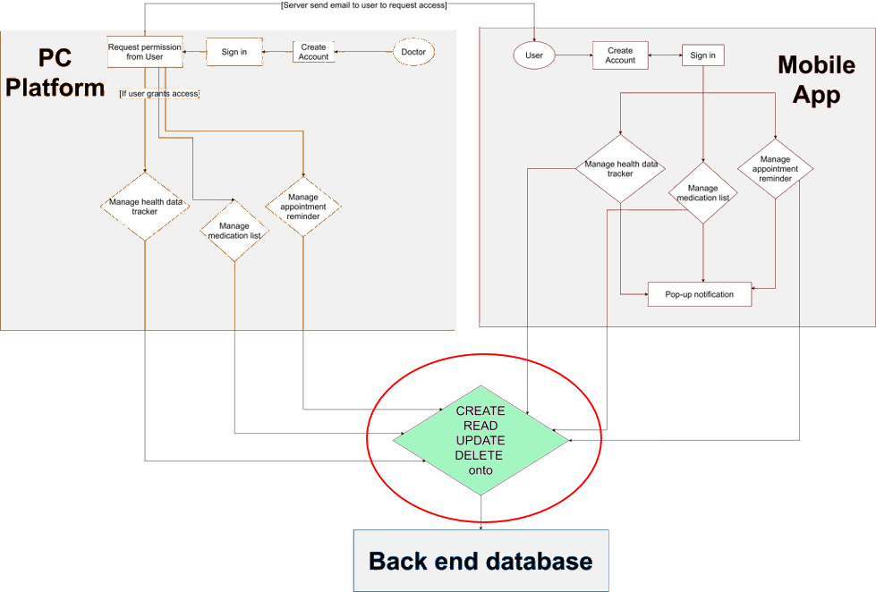

# SEGP9b_php

## Description

This repository contains the PHP files for the CRUD operations used for the MOBILE APPLICATION PLATFORM of the 'medPal' project.

## Block Diagram

This is one of the three repositories of the medPal project.

Link to other repositories:

- Repository for Android Mobile Application: *https://github.com/agb2k/SEGP-9B*
- Repository for PC Platform: *https://github.com/bulacke/SEGP9B-PC_Platform*
